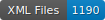

# DLA_ArcheoPol_FR_16

    

This repository contains data on the segmentation of early modern printed French texts (c. 1570).

## Content

| Author           | Title                | Date     | Location | Publisher | Segmentation |
|------------------|----------------------|----------|----------|-----------|--------------|
| de Bèze,  Théodore | [_Du droit des Magistrats sur leurs subjets_](https://doi.org/10.3931/e-rara-1064) | 1574     | Bern  | Jacob Stoer | N. Champeaux |
| Cosmopolite,  Eusèbe Philadelphe | [_Le reveille-matin des François et de leurs voisins_](https://www.google.it/books/edition/Le_Reveille_matin_des_Fran%C3%A7ois_et_de_le/GBRr1rSDsQMC?hl=it&gbpv=1) | 1574 | Lyon | Le Preux | N. Champeaux |
| Iunius Brutus, Stephanus | [*De La Puissance Legitime du Prince*](https://doi.org/10.3931/e-rara-6435) | 1581     | Geneva   | s.n. | L. Paoli     |
| de Coras, Jean | Question Politique | 1569    | Bern   | s.n. | A.Bianco    |
| de Coras, Jean | [_Question Politique_](https://books.google.ch/books?id=7cLTKl76iJsC&pg=PA355) | 1570     | London   | Barthélemy Berton | A. Bianco     |
| Hotman François | [*La Francogallia*](https://www.digitale-sammlungen.de/en/view/bsb10177492?page=4,5) | 1573     | Munich| Jacob Stoer | L.Paoli     |
| s.n. | [Le Politique. *Dialogue traittant de la puissance, authorité, & du devoir des Princese*](http://digital.onb.ac.at/OnbViewer/viewer.faces?doc=ABO_%2BZ22450210X) | 1576     | s.n | Heinrich Wolf | A.Bianco et N.Champeaux     |
| s.n. | [_Discours politiques des diverses puissances establies de Dieu au monde_](https://doi.org/10.3931/e-rara-29284) | 1578     | Lausanne | Heinrich Wolf | N. Champeaux |

## How to cite

If you use this dataset, please cite it as below : Champeaux, N., Bianco, A., Paoli, L., _ARCHÉO-Pol : la Bibliothèque des Monarchomaques_, version 1.0 : Genève, juin 2025.
 
## Licences

  
